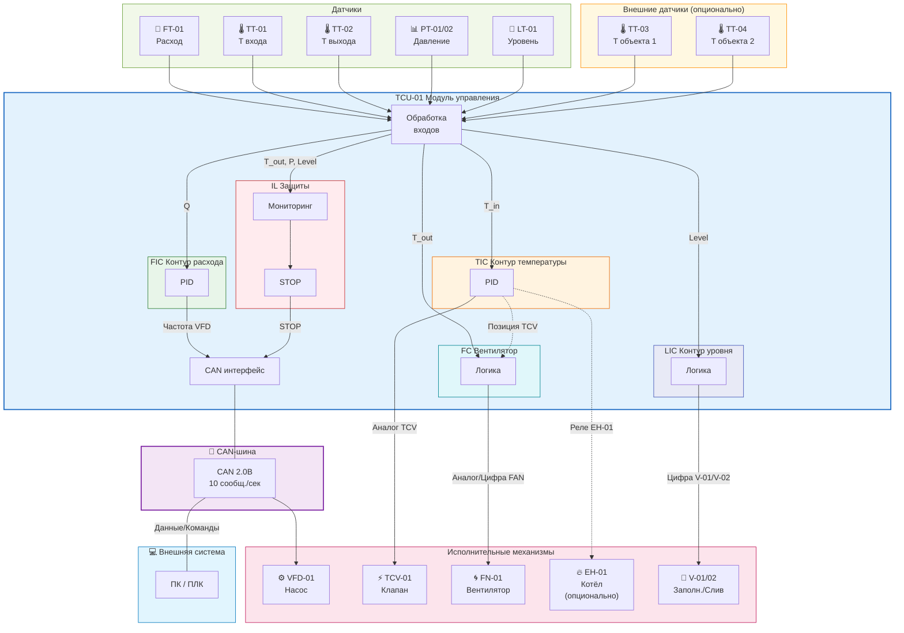

# Система термостатирования

## Назначение

Реализация режимов работы преоборазователей, модулей, электродвигателей в части поддержания требуемой температуры теплоносителя в рабочем диапазоне температур с требуемой точностью.

## Требования

1. **Регулирование температуры жидкости:** температура входной жидкости
   в баке с охлаждающей жидкостью должна поддерживаться в диапазоне
   от +25 °C до +60 °C с точностью регулирования ±2 °C.
   *Примечание: температура не может быть отрегулирована ниже температуры
   окружающего воздуха, поэтому нижнее значение диапазона не гарантируется.*

2. **Регулирование расхода жидкости:** система термостатирования должна
   регулировать расход входной жидкости в диапазоне от 1 л/мин до 130 л/мин
   с точностью ±0,5 л/мин. Пользователи системы термостатирования, если необходимо,
   могут приближённо пересчитывать скорость потока на основании измеренного расхода
   и известного сечения трубопровода. 

3. **Максимальная рассеиваемая мощность:** радиатор должен обеспечивать
   рассеиваемую мощность до 10 кВт при разнице температур хладогента и окружающей среды 10 °C.

4. **Тип системы:** система термостатирования должна быть замкнутой;
   нагрев хладоносителя осуществляется за счёт потерь исследуемого объекта.
   Для ускорения выхода на рабочую температуру опционально может использоваться
   электрический проточный котёл мощностью 3–6 кВт, включаемый в цепь байпаса.
   Котёл управляется релейно от контроллера TCU-01.

5. **Измерение параметров хладоносителя:** система должна иметь датчики
   состояния хладоносителя на входе и выходе испытательной секции
   с исследуемым объектом (температура, давление в трубе,
   расход жидкости). Результаты измерения
   должны передаваться в CAN-шину с периодичностью не менее 10 посылок в секунду.

6. **Заполнение и слив:** система должна предусматривать возможность
   заполнения и опорожнения хладоносителя (желательно автоматизировано).

7. **Испытательная секция:** исследуемый объект (двигатель в баке,
   система с охлаждающей рубашкой и т.п.) должен быть сменным
   и предусматривать возможность быстрой замены.
   Пользователи системы должны самостоятельно разрабатывать исследуемый объект, 
   будь то бак или рубашка и способы его включения в систему термостатирования.
   Необходимо согласовать выводные (терминальные) элементы системы термостатирования через которые осуществляетсями подключение обьекта к системе термостатирования. 

8. **Хладоноситель:** ожидаемый хладоноситель — вода.

9. **Модуль управления и интерфейс:** система термостатирования
   должна иметь единый модуль управления, питающийся от общей электриской сети (~220 или =24В).
   Насос (VFD-01) управляется по шине CAN.
   Остальные исполнџительные механизмы (TCV-01, FN-01, V-01, V-02, EH-01)
   управляются аналоговыми или цифровыми сигналами от TCU-01.
   Шина CAN выведена на внешние разъёмы системы.

10. **Гидравлическая схема с байпасом:** контур охлаждения должен
    содержать трёхходовой регу
    лирующий клапан, обеспечивающий
    перераспределение потока между ветвью через радиатор и байпасной
    ветвью в обход радиатора, с последующим смешением потоков перед
    входом в испытательную секцию.

11. **Внешние датчики температуры (опционально):** система термостатирования должна
    предоставлять выводы контроллера (TCU-01) для подключения двух
    внешних датчиков температуры для мониторинга температуры
    исследуемого объекта. Датчики подключаются по усмотрению пользователя.
    Данные с внешних датчиков обрабатываются контроллером
    и передаются в CAN-шину вместе с остальными измерениями.

---

## Структурная схема

Обозначения по стандарту ISA-5.1 (ANSI/ISA-5.1-2009)

### 1. Гидравлический контур

- Расширительный бак TK-01 служит для компенсации теплового расширения
  воды и поддержания давления в системе. К нему подключены:
  - Клапан заполнения V-01 (от внешнего источника воды)
  - Клапан слива V-02 (для опорожнения системы)
  - Датчик уровня LT-01 (для контроля заполнения)
- Из TK-01 вода подаётся на фильтр STR-01 для очистки от загрязнений.
- После фильтра вода поступает на насос P-01 с частотным приводом VFD-01.
- После насоса последовательно установлены: расходомер FT-01, датчик давления PT-01.
- Далее поток поступает на вход испытательной секции TK-02
  с исследуемым объектом (DUT), подключённой через быстроразъёмные соединения.
- На входе TK-02 установлен датчик температуры TT-01,
  на выходе — датчик температуры TT-02 и датчик давления PT-02.
- На выходе испытательной секции поток подаётся на трёхходовой клапан TCV-01,
  который распределяет расход между ветвью через радиатор HX-01 с вентилятором
  FN-01 и байпасной ветвью в обход радиатора.
- В байпасной ветви опционально может быть установлен электрический
  проточный котёл EH-01 мощностью 3–6 кВт для ускорения нагрева системы;
  котёл управляется релейно от TCU-01.
- После радиатора и байпаса потоки смешиваются в узле MIX-01 и по линии «обратка»
  возвращаются в расширительный бак TK-01.

### 2. Измерения и датчики

- FT-01 — расходомер, измеряет расход Q в линии подачи (1–20 л/мин).
- TT-01 — датчик температуры на входе испытательной секции (10–40 °C).
- TT-02 — датчик температуры на выходе испытательной секции.
- PT-01 — датчик давления на входе испытательной секции.
- PT-02 — датчик давления на выходе испытательной секции.
- LT-01 — датчик уровня в расширительном баке TK-01.
- TT-03, TT-04 — внешние датчики температуры (опционально) для мониторинга
  исследуемого объекта (подключаются к выводам TCU-01).

### 3. Контур регулирования расхода (FIC)

- На вход FIC подаётся сигнал расхода Q от FT-01.
- Выход FIC формирует управляющее воздействие на VFD-01 насоса P-01
  (задание частоты вращения), обеспечивая поддержание заданного расхода.

### 4. Контур регулирования температуры (TIC)

- На вход TIC подаётся сигнал температуры T_in от TT-01.
- Выход TIC управляет положением трёхходового клапана TCV-01,
  распределяя поток между ветвью через радиатор HX-01 и байпасом.
- Таким образом обеспечивается поддержание температуры на входе
  испытательной секции в требуемом диапазоне.

### 5. Управление вентилятором (FC)

- Скорость вентилятора FN-01 регулируется в зависимости от температуры
  на выходе TT-02 и положения клапана TCV-01.

### 6. Контур регулирования уровня (LIC)

- На вход LIC подаётся сигнал уровня от LT-01.
- LIC управляет клапанами V-01 (заполнение) и V-02 (слив)
  для автоматического поддержания уровня воды в системе.

### 7. Логика защит и разрешений (IL)

- Блок IL получает сигналы TT-02, PT-01, PT-02, LT-01.
- IL формирует сигналы «разрешение работы» для контуров FIC, TIC, LIC,
  а также выполняет аварийное отключение оборудования
  при выходе параметров за допустимые пределы:
  - Превышение давления (P_max)
  - Превышение температуры (T_max)
  - Низкий уровень воды (Level_min)

### 8. Единый модуль управления TCU-01 и интерфейс

- Контроллер термостата TCU-01 содержит реализации FIC, TIC, FC, LIC и IL.
- Датчики подключены к входам TCU-01 (аналоговые, цифровые или по шине данных).
- TCU-01 предоставляет выводы для опционального подключения двух внешних датчиков
  температуры TT-03 и TT-04 для мониторинга исследуемого объекта.
- Насос (VFD-01) управляется по шине CAN.
- Остальные исполнительные механизмы (TCV-01, FN-01, V-01, V-02, EH-01)
  управляются аналоговыми или цифровыми сигналами от TCU-01.
- Модуль управления питается от единой вводной линии и имеет интерфейс
  CAN для обмена данными с внешней системой:
  частота передача измерений (10 сообщений/сек), состояний, аварий
  и приём уставок/команд.

---

## Гидравлическая схема (P&ID)

```mermaid
flowchart LR
    subgraph EXPANSION["Expansion Tank"]
        direction TB
        LT-01["LT-01<br/>Level<br/>Transmitter"]
        TK-01[("TK-01<br/>Expansion Tank")]
    end

    subgraph FILL_DRAIN["Fill / Drain System"]
        direction TB
        WATER_IN["Water Supply"]
        V-01["V-01<br/>Fill Valve"]
        V-02["V-02<br/>Drain Valve"]
        DRAIN_OUT["Drain"]
    end

    subgraph SUPPLY["Supply Line"]
        direction LR
        P-01["P-01<br/>Pump"]
        VFD-01["VFD-01<br/>VFD"]
        STR-01["STR-01<br/>Strainer"]
        FT-01["FT-01<br/>Flow Transmitter<br/>1-20 L/min"]
        PT-01["PT-01<br/>Pressure<br/>Transmitter"]
        TT-01["TT-01<br/>Temp. In"]
        TT-02["TT-02<br/>Temp. Out"]
        PT-02["PT-02<br/>Press. Out"]
    end

    subgraph DUT["Test Object (removable, ≤1h swap)"]
        TK-02[("DUT<br/>Device Under Test<br/>(≤10 kW)")]
    end

    subgraph COOLING["Cooling Circuit"]
        direction TB
        FN-01["FN-01<br/>Fan"]
        TCV-01{"TCV-01<br/>3-Way Valve"}
        HX-01["HX-01<br/>Heat Exchanger<br/>10 kW"]
        EH-01["EH-01<br/>Electric Heater<br/>3-6 kW<br/>(optional, bypass)"]
        MIX-01(("MIX-01"))
    end

    %% Fill and Drain connections
    WATER_IN --> V-01
    V-01 --> TK-01
    TK-01 --> V-02
    V-02 --> DRAIN_OUT
    LT-01 -.-> TK-01

    %% Main circuit - Supply
    TK-01 --> STR-01
    STR-01 --> P-01
    VFD-01 -.->|Ctrl| P-01
    P-01 --> FT-01
    FT-01 --> PT-01
    
    %% Test section
    PT-01 --> TT-01
    TT-01 --> TK-02
    TK-02 --> TT-02
    TT-02 --> PT-02
        
    %% Return line
    MIX-01 -->|Return| TK-01
    
    %% Cooling circuit
    PT-02 --> TCV-01
    TCV-01 -->|Cool| HX-01
    TCV-01 -->|Bypass| EH-01
    EH-01 --> MIX-01
    FN-01 -.-> HX-01
    HX-01 --> MIX-01

    %% Styles
    style TK-02 fill:#fff3e0,stroke:#e65100
    style TK-01 fill:#e1f5fe,stroke:#01579b
    style HX-01 fill:#e8f5e9,stroke:#2e7d32
    style EH-01 fill:#ffebee,stroke:#c62828,stroke-dasharray: 5 5
    style TCV-01 fill:#fce4ec,stroke:#c2185b
    style FT-01 fill:#e3f2fd,stroke:#1565c0
    style PT-01 fill:#f3e5f5,stroke:#7b1fa2
    style PT-02 fill:#f3e5f5,stroke:#7b1fa2
    style V-01 fill:#c8e6c9,stroke:#388e3c
    style V-02 fill:#ffcdd2,stroke:#d32f2f
    style LT-01 fill:#b3e5fc,stroke:#0288d1
```

---

## Схема системы управления

---

## Таблица элементов системы

| Обозначение | Наименование | Функция | Параметры |
|-------------|--------------|---------|-----------|
| TK-01 | Расширительный бак | Компенсация расширения, поддержание давления | С датчиком уровня |
| DUT (TK-02) | Испытуемый объект | Исследуемый объект (двигатель, система с рубашкой и т.п.) | Сменный, быстроразъёмные соединения, до 1 ч замена |
| P-01 | Насос | Циркуляция хладоносителя | С частотным приводом VFD-01 |
| VFD-01 | Частотный привод | Регулирование оборотов насоса | Управление от FIC, CAN |
| STR-01 | Фильтр | Очистка хладоносителя, защита насоса | Перед насосом |
| FT-01 | Расходомер | Измерение расхода | 1-20 л/мин, ±0.5 л/мин |
| TT-01 | Датчик температуры | Измерение T на входе объекта | 10-40°C |
| TT-02 | Датчик температуры | Измерение T на выходе объекта | Для защит и FC |
| PT-01 | Датчик давления | Контроль давления на входе | Для защит |
| PT-02 | Датчик давления | Контроль давления на выходе | Для защит |
| LT-01 | Датчик уровня | Контроль уровня в TK-01 | Для LIC и защит |
| TT-03 | Внешний датчик температуры | Мониторинг T исследуемого объекта | Опционально, подключается к TCU-01 |
| TT-04 | Внешний датчик температуры | Мониторинг T исследуемого объекта | Опционально, подключается к TCU-01 |
| TCV-01 | Трёхходовой клапан | Распределение потока | Радиатор/Байпас, аналоговое упр. |
| HX-01 | Радиатор | Охлаждение хладоносителя | До 10 кВт |
| EH-01 | Электрический котёл | Ускорение нагрева системы | Опционально, 3–6 кВт, байпас, релейное упр. |
| FN-01 | Вентилятор | Обдув радиатора | Управление от FC, аналог/цифра |
| V-01 | Клапан заполнения | Заполнение системы | Управление от LIC, цифровое |
| V-02 | Клапан слива | Опорожнение системы | Управление от LIC, цифровое |
| MIX-01 | Узел смешения | Смешение потоков | После радиатора и байпаса |
| TCU-01 | Контроллер | FIC, TIC, FC, LIC, IL | CAN интерфейс |

---

## Основные технические характеристики

| Параметр | Значение |
|----------|----------|
| Диапазон температуры | +25°C ... +60°C (±2°C) |
| Диапазон расхода | 1 ... 130 л/мин (±0,5 л/мин) |
| Тепловая мощность | до 10 кВт |
| Хладоноситель | вода |
| Интерфейс | CAN 2.0B (10 сообщений/сек) |
| Тип системы | замкнутая с байпасом |
